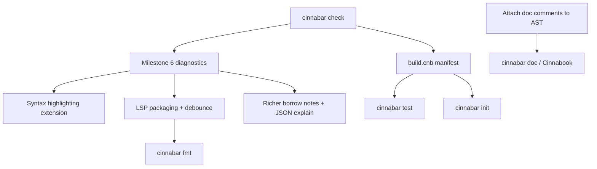

# Cinnabar Tooling Strategy

Planning document for developer tooling around the Cinnabar programming language. The language spec is [`MANIFESTO.md`](../MANIFESTO.md); the compiler architecture is [`ARCHITECTURE.md`](../ARCHITECTURE.md); the product roadmap is [`ROADMAP.md`](../ROADMAP.md).

---

## Design principle

Cinnabar's tooling should **surface facts the compiler already computed**, not re-derive them. The pipeline attaches symbol ids (resolver), type keys (typechecker), field offsets and variant tags (typechecker), and linearity flags (typechecker, read by borrow/codegen). Every tool — CLI flags, LSP, doc generator — must consume those attachments via `src/lib.rs` and obey the Single-Fact Rule from [`AGENTS.md`](../AGENTS.md).

Most languages need tooling to paper over implicit behavior (lifetimes, coercions, configurable lints). Cinnabar's opportunity is the opposite: make explicit semantics visible — linear consumption paths, borrow origins, tail-call eligibility, `impure` boundaries, unhandled `Result`/`Option`.

---

## Current state

### Implemented

| Tool | Location | What it does |
|------|----------|--------------|
| **`cinnabar` CLI** | `src/main.rs` | Compile, `-o`, `--run`, `-O`, `--dump-ast` |
| **`--dump-typed-ast`** | `src/inspect.rs` | Full front-end, then serialized arena with attachments |
| **`--print-layout`** | `src/codegen/layout.rs` | ABI sizes/alignments/offsets via same LLVM lowering as codegen |
| **`--emit-llvm` / `--emit-obj`** | `src/codegen/mod.rs` | Stop after IR or object emission |
| **`--explain-borrow`** | `src/borrow.rs` + `src/ast.rs` (`Note`) | Secondary labels on borrow/linearity errors |
| **`cinnabar::analysis`** | `src/analysis.rs` | Hover, go-to-def, references, completion, signature help over attached facts; unsaved-buffer overlay |
| **`cinnabar-lsp`** | `src/bin/cinnabar_lsp.rs` | JSON-RPC LSP shell: diagnostics, hover, definition, references, completion, signature help |
| **Fixture harness** | `pre_commit_check.sh`, `tests/repro_harness.rs` | Positive/negative compile-and-run tests |
| **Property fuzzer** | `tests/fuzz_generalization.rs` | Random well-typed programs + linearity rejection corpus |

### Not yet implemented

- `cinnabar check` (front-end only, no codegen — today `--dump-typed-ast` / `--print-layout` run the front-end but are debug dumps, not a dedicated check mode)
- `build.cnb` project manifest and `cinnabar build` / `cinnabar test` / `cinnabar init`
- Milestone 6 multi-label diagnostics and suggestion engine
- Doc comment attachment to AST + `cinnabar doc` / Cinnabook
- Mushlings (interactive exercises)
- Formatter (`cinnabar fmt`)
- Editor syntax highlighting extension (TextMate / Tree-sitter)
- Incremental re-check in LSP (full pipeline re-run per change today)
- FFI / native stub generator
- Cross-target build driver
- Diagnostic snapshot testing tool

---

## Already on the roadmap (high leverage)

These unlock everything else and are tracked in [`ROADMAP.md`](../ROADMAP.md):

| Tool | Milestone | Why it matters |
|------|-----------|----------------|
| **`cinnabar check`** | 5 | Dedicated fast feedback without LLVM/clang; natural default for IDE save hooks |
| **`build.cnb` + `build`/`run`/`test`** | 5 | Project roots, entry points, test discovery — today the CLI takes a single file path |
| **Rich diagnostics + suggestions** | 6 | Multi-label Ariadne (error site + definition), hedged "did you mean" — primary UX in a no-warnings language |
| **Cinnabook + Mushlings** | 8 | Docs server + rustlings-style exercises from real compiler errors |
| **Sanitizer gate** | 7 | ASan/UBSan/Valgrind over all fixtures — verification tooling for the Crucible Rule |

---

## Tier 1 — Extend the attached-facts stack

Most of Tier 1 is **started**; remaining work is polish, performance, and IDE packaging.

### Language Server (`cinnabar-lsp`) — in progress

**Done:** hover, go-to-definition, find references, completion (locals, keywords, fields after `.`), signature help, diagnostics with borrow `Note`s as `relatedInformation`, full-document sync with unsaved overlay.

**Next:**

- Debounced incremental analysis (same pipeline, smarter scheduling)
- Workspace root / multi-root project discovery once `build.cnb` exists
- Publish VS Code / Cursor extension that launches `cinnabar-lsp` and registers the grammar
- Code actions only when they are structurally correct (no "suppress" or stub suggestions — per Milestone 6)

### Borrow / linearity explainer — partially done

**Done:** `Note` rows on join inconsistencies, unconsumed-at-exit, use-after-move; CLI `--explain-borrow`; LSP always sends related information.

**Next:**

- Richer path-sensitive notes (which branch left a linear value live)
- Optional structured `--explain-borrow=json` for tooling/tests
- Mushlings exercises keyed to exact diagnostic + note text

### Low-level inspection — done

`--emit-llvm`, `--emit-obj`, `--dump-typed-ast`, `--print-layout` cover the systems-programmer and self-hosting debugging needs. Future: source-correlated disassembly once debug info is emitted.

---

## Tier 2 — Editor and syntax layer

### TextMate / Tree-sitter grammar

Newline-separated statements, four comment forms, no semicolons. Cheapest way to make the language feel real in editors before deeper LSP integration.

### Formatter (`cinnabar fmt`)

Casing is lexical (enforced by the lexer/resolver), not formattable. A formatter's job is narrow:

- Indentation inside `fun` / `while` / `match` / `mod` blocks
- Consistent blank lines between top-level items
- Optional normalization of `use` ordering

One canonical style, no configurability — aligned with "errors only, no lint configuration."

---

## Tier 3 — Documentation pipeline

Doc comments (`#!`, `#!|`) are recognized by the lexer but **not yet attached** to the following item in the AST (see [`ARCHITECTURE.md`](../ARCHITECTURE.md) Stage 2).

Build order:

1. Attach doc strings during parse/lex (per `MANIFESTO.md` comment semantics)
2. **`cinnabar doc`** — HTML from `pub` items + attached docs
3. **Cinnabook** (roadmap) — local server bundling docs + manifesto sections, version-pinned to the installed compiler

Strict visibility (`pub` required, private by default) keeps doc generation simple.

---

## Tier 4 — Project and test tooling

### `cinnabar test`

Discover and run `.cnb` test files. The existing harness (`pre_commit_check.sh`, `EXPECT_OK` / `EXPECT_REJECTED` in repro fixtures) is the prototype — promote into the compiler CLI once `build.cnb` defines entry points.

### `cinnabar init`

Scaffold `main.cnb`, `build.cnb`, test layout. Depends on Milestone 5 manifest format (compile-time string representation TBD in roadmap).

### Diagnostic snapshot testing

The repro corpus (`tests/fixtures/repro/`) is a gold mine. A tool that compiles expecting rejection and snapshots exact diagnostic text + span labels protects Milestone 6 work and makes Mushlings trivial to maintain.

---

## Tier 5 — Systems-programming-specific tools

### Native surface / FFI stub generator

Explicit `nat fun` / `nat type` declarations. A tool reading C headers (or a minimal IDL) and emitting Cinnabar native stubs reduces boilerplate for syscall wrappers — aligned with Milestone 4's direct-syscall philosophy.

### Binary inspection

After compile: disassembly wrapper with source correlation (when debug info exists); per-function / per-type size report.

### Cross-target driver

When AArch64 lands (roadmap mentions it for syscalls): `cinnabar build --target …` wrapper around existing `llc` + `clang -nostdinc` pipeline.

---

## Tier 6 — Learning and verification (longer horizon)

| Tool | Role |
|------|------|
| **Mushlings** (planned) | Interactive fixes for linearity, unhandled `Result`, tail-recursion, borrow ambiguity — all real error classes with fixtures today |
| **Fuzz replay UI** | Fuzzer saves `fuzz_fail_<seed>.cnb`; CLI to replay/minimize seeds |
| **Type soundness artifact** | Milestone 7 — Coq in `flake.nix` hints at formal verification aspirations |
| **Playground** | Compile-and-run in browser — only after self-hosting or WASM port |

---

## What not to build (by design)

Per [`MANIFESTO.md`](../MANIFESTO.md) anti-principles:

- **No clippy / configurable lints** — the compiler *is* the linter
- **No macro expander** — macros do not exist
- **No lifetime visualization** — no lifetime annotations; borrow visualization replaces this
- **No panic/backtrace debuggers as first-class tools** — Crucible Rule pushes failures to compile time
- **No dynamic-linking package manager early on** — static-only philosophy

---

## Suggested build order

**Phase 1:** `cinnabar check`, Milestone 6 diagnostics, editor grammar + LSP extension packaging  
**Phase 2:** `build.cnb`, test runner, diagnostic snapshots  
**Phase 3:** Doc pipeline, Mushlings, formatter  
**Phase 4:** FFI stubgen, cross-target, binary inspection — as the language surface stabilizes

---

## Why this fits Cinnabar specifically

The flat arena + attached facts architecture means an LSP, CLI explainer, and future doc generator can share `cinnabar::analysis` and read the same `NODE_TYINFO` / `NODE_SYM` / `NODE_FIELDKEY` rows codegen consumes. That is a structural advantage: tooling is a **consumer layer**, not a parallel compiler frontend.

Borrow/linearity diagnostics are effectively the primary day-to-day UX surface (see [`ARCHITECTURE.md`](../ARCHITECTURE.md)); investing in explainers, Mushlings, and Milestone 6 multi-label rendering has higher payoff than generic IDE features.

---

## References

- [`ARCHITECTURE.md`](../ARCHITECTURE.md) — pipeline, arena, existing tooling hooks
- [`ROADMAP.md`](../ROADMAP.md) — Milestones 5–8 (build system, diagnostics, verification, Cinnabook/Mushlings)
- [`src/analysis.rs`](../src/analysis.rs) — IDE query API
- [`src/bin/cinnabar_lsp.rs`](../src/bin/cinnabar_lsp.rs) — LSP server
